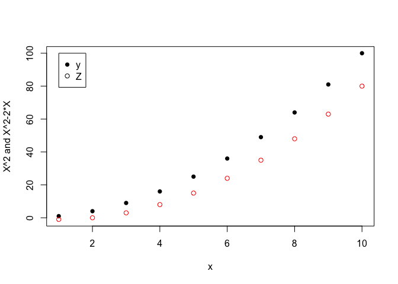
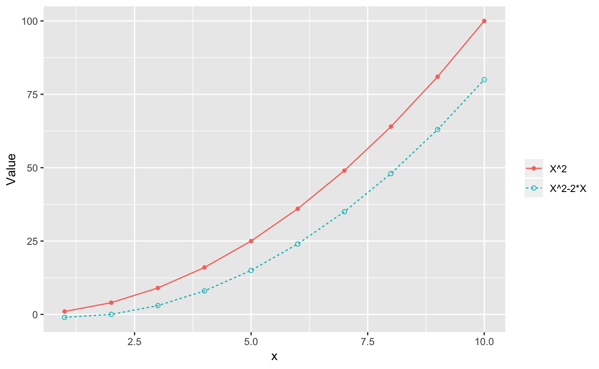
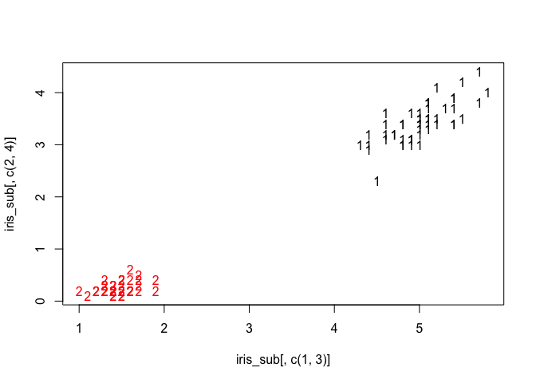
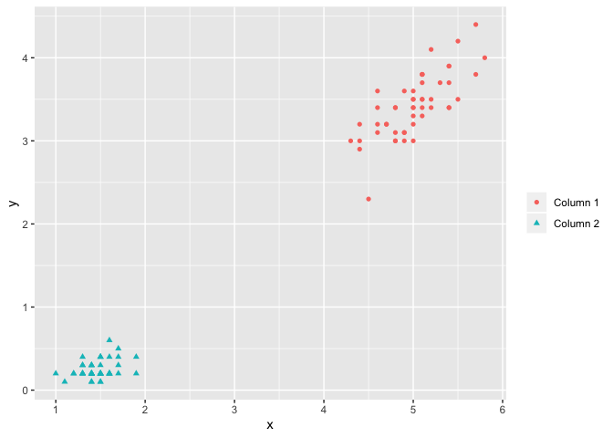
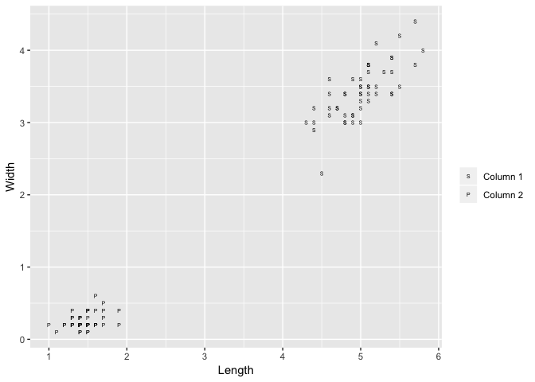
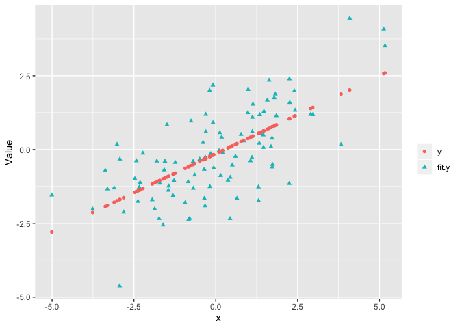

<!-- README.md is generated from README.Rmd. Please edit that file -->

# ggmatplot

<!-- badges: start -->

<!-- badges: end -->

The goal of ggmatplot is to plot the columns of one matrix against the
columns of another.

## Installation

You can install the released version of ggmatplot by the following
commands:

``` r
library(devtools)
install_github("xuan-liang/ggmatplot")
```

Below are some basic examples which show you how to use this package.

### Example 1

``` r
X <- 1:10
Y=X^2
Z=X^2-2*X

# Original way by matplot function
matplot(X,cbind(Y,Z),pch=c(16,1),xlab="x",ylab="X^2 and X^2-2*X")
legend(1,100,legend=c("y","Z"),pch=c(16,1)) 
```



``` r

# Use ggmatplot
ggmatplot(X,cbind(Y,Z), shape = c(16,1),legend_label =  c("X^2","X^2-2*X"),geom=c("point","line"))
```



#### Example 2: Iris data

``` r
iris_sub <- subset(iris, Species == "setosa")

# Original way by matplot function
matplot(iris_sub[,c(1,3)], iris_sub[,c(2,4)])
```



``` r

# Use default legend and axis
ggmatplot(iris_sub[,c(1,3)], iris_sub[,c(2,4)])
```



``` r

# Modify legend label and axis
ggmatplot(iris_sub[,c(1,3)], iris_sub[,c(2,4)], color = 1 ,shape = c("S","P"), xlab = "Length", ylab="Width")
```



### Example 3: Linear regression

``` r
x <- rnorm(100,sd=2)
y <- x*0.5+rnorm(100,sd=1)
fit.y <- fitted(lm(y~x))
ggmatplot(x,cbind(y,fit.y))
```


