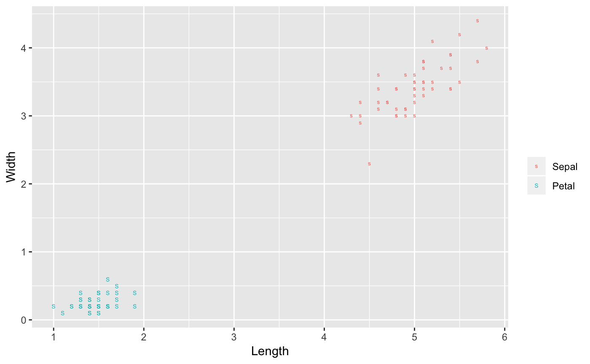

<!-- README.md is generated from README.Rmd. Please edit that file -->

# ggmatplot

<!-- badges: start -->

<!-- badges: end -->

The goal of ggmatplot is to plot the columns of one matrix against the
columns of another.

## Installation

You can install the released version of ggmatplot by the following
commands:

``` r
library(devtools)
install_github("xuan-liang/ggmatplot")
```

## Example

This is a basic example which shows you how to use this package:

``` r
library(ggmatplot)
#> Loading required package: tidyverse
#> Registered S3 methods overwritten by 'ggplot2':
#>   method         from 
#>   [.quosures     rlang
#>   c.quosures     rlang
#>   print.quosures rlang
#> Registered S3 method overwritten by 'rvest':
#>   method            from
#>   read_xml.response xml2
#> ── Attaching packages ───────────────────────────────────────────────────────────────────────────────────────── tidyverse 1.2.1 ──
#> ✔ ggplot2 3.1.1       ✔ purrr   0.3.2  
#> ✔ tibble  2.1.1       ✔ dplyr   0.8.0.1
#> ✔ tidyr   0.8.3       ✔ stringr 1.4.0  
#> ✔ readr   1.3.1       ✔ forcats 0.4.0
#> ── Conflicts ──────────────────────────────────────────────────────────────────────────────────────────── tidyverse_conflicts() ──
#> ✖ dplyr::filter() masks stats::filter()
#> ✖ dplyr::lag()    masks stats::lag()

iris_sub <- subset(iris, Species == "setosa")

# Original way by matplot function
matplot(iris_sub[,c(1,3)], iris_sub[,c(2,4)])
```


``` r

# Use default legend and axis
ggmatplot(iris_sub[,c(1,3)], iris_sub[,c(2,4)])
```


``` r

# Modify legend label and axis
ggmatplot(iris_sub[,c(1,3)], iris_sub[,c(2,4)], shape = c("s","S"), legend_label =  c("Sepal","Petal"), legend_title = "", xlab = "Length", ylab="Width")
```



``` r

# Linear regression
x <- rnorm(100,sd=2)
y <- x*0.5+rnorm(100,sd=1)
fit.y <- fitted(lm(y~x))
ggmatplot(x,cbind(y,fit.y))
```


