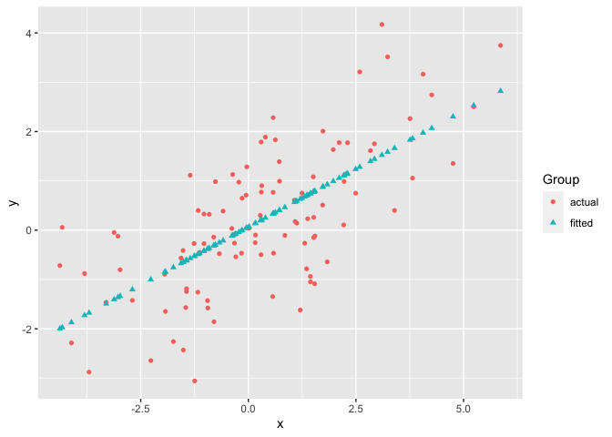
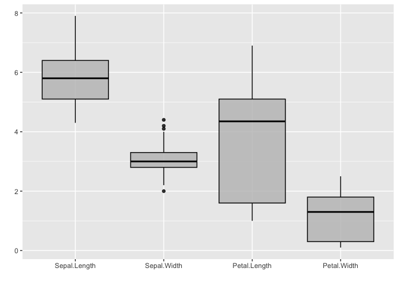
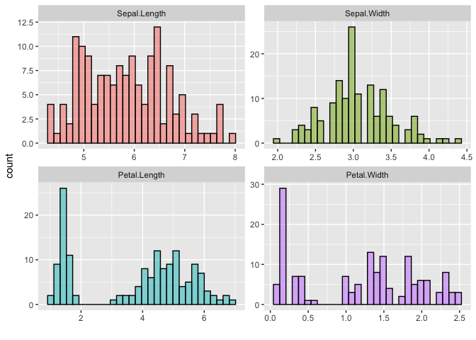

# ggmatplot

`ggmatplot` is a quick and easy way of plotting the columns of two
matrices or data frames against each other using
[`ggplot2`](https://ggplot2.tidyverse.org/).

## Overview

[`ggplot2`](https://ggplot2.tidyverse.org/) requires wide format data to
be wrangled into long format for plotting, which can be quite cumbersome
when creating simple plots. Therefore, the motivation for `ggmatplot`
was to provide a solution that allows
[`ggplot2`](https://ggplot2.tidyverse.org/) to handle wide format data.
Although `ggmatplot` doesn’t provide the same flexibility as
[`ggplot2`](https://ggplot2.tidyverse.org/), it can be used as a
workaround for having to wrangle wide format data into long format for
plotting with [`ggplot2`](https://ggplot2.tidyverse.org/).

`ggmatplot` is built upon [`ggplot2`](https://ggplot2.tidyverse.org/),
and its functionality is inspired by
[`matplot`](https://www.rdocumentation.org/packages/graphics/versions/3.6.2/topics/matplot).
Therefore, `ggmatplot` can be considered as a `ggplot` version of
[`matplot`](https://www.rdocumentation.org/packages/graphics/versions/3.6.2/topics/matplot).

Similar to
[`matplot`](https://www.rdocumentation.org/packages/graphics/versions/3.6.2/topics/matplot),
`ggmatplot` plots a vector against the columns of a matrix, or the
columns of two matrices against each other, or a vector/matrix on its
own. However, unlike
[`matplot`](https://www.rdocumentation.org/packages/graphics/versions/3.6.2/topics/matplot),
`ggmatplot` returns a `ggplot` object. Therefore, [ggplot add
ons](https://ggplot2.tidyverse.org/reference/index.html) such as scales,
faceting specifications, coordinate systems and themes can also be added
on to the resultant `ggplot` object.

## Installation

The latest version can be installed from
[GitHub](https://github.com/xuan-liang/ggmatplot):

``` r
# install.packages("remotes")
remotes::install_github("xuan-liang/ggmatplot")
```

## Examples

``` r
library(ggmatplot)
library(ggplot2)
```

``` r
# matrix x
x <- rnorm(100,sd=2)

# matrix y
y = x*0.5+rnorm(100,sd=1)
fit.y = fitted(lm(y~x))
z <- cbind(y, fit.y)

ggmatplot(x, z)
```



``` r
# matrix x
x <- 1:10

# matrix y
y <- cbind(
  square = x^2,
  cube = x^3
)

ggmatplot(x, y,
          plot_type = "line",
          size = 1,
          color = c("blue", "purple"),
          ylim = c(0,750)) +
  theme_minimal()
#> Warning: Removed 1 row(s) containing missing values (geom_path).
```


``` r
USPersonalExpenditure
#>                       1940   1945  1950 1955  1960
#> Food and Tobacco    22.200 44.500 59.60 73.2 86.80
#> Household Operation 10.500 15.500 29.00 36.5 46.20
#> Medical and Health   3.530  5.760  9.71 14.0 21.10
#> Personal Care        1.040  1.980  2.45  3.4  5.40
#> Private Education    0.341  0.974  1.80  2.6  3.64

# matrix x
x <- rownames(USPersonalExpenditure)

# matrix y
y <- USPersonalExpenditure[, 1:5]

ggmatplot(x, y,
          plot_type = "both",
          xlab = "Category",
          ylab = "Expenditure (in Billions of Dollars)",
          legend_title = "Year",
          legend_label = c(1940, 1945, 1950, 1955, 1960)
          ) +
  theme(axis.text.x = element_text(angle = 45, hjust = 1))
```


``` r
iris_sub <- subset(iris, Species == "setosa")

# matrix X
x <- (iris_sub[,1:2])
head(x,5)
#>   Sepal.Length Sepal.Width
#> 1          5.1         3.5
#> 2          4.9         3.0
#> 3          4.7         3.2
#> 4          4.6         3.1
#> 5          5.0         3.6

ggmatplot(x, plot_type = "density") + 
  # scaling the density estimate to a maximum of 1
  aes(y = ..scaled..) +
  theme_bw()
```


``` r
iris_sub <- subset(iris, Species == "setosa")

# matrix X
x <- (iris_sub[,1:4])
head(x,5)
#>   Sepal.Length Sepal.Width Petal.Length Petal.Width
#> 1          5.1         3.5          1.4         0.2
#> 2          4.9         3.0          1.4         0.2
#> 3          4.7         3.2          1.3         0.2
#> 4          4.6         3.1          1.5         0.2
#> 5          5.0         3.6          1.4         0.2

ggmatplot(x, plot_type = "boxplot",
          alpha = 0, # removing fill values
          xlab = "", ylab = "")
```



``` r
iris_sub <- subset(iris, Species == "setosa")

# matrix X
x <- (iris_sub[,1:2])
head(x,5)
#>   Sepal.Length Sepal.Width
#> 1          5.1         3.5
#> 2          4.9         3.0
#> 3          4.7         3.2
#> 4          4.6         3.1
#> 5          5.0         3.6

ggmatplot(x, plot_type = "violin",
          color = c("#00AFBB", "#E7B800"),
          xlab = "", ylab = "")
```


``` r
iris_sub <- subset(iris, Species == "setosa")

# matrix X
x <- (iris_sub[,1:4])
head(x,5)
#>   Sepal.Length Sepal.Width Petal.Length Petal.Width
#> 1          5.1         3.5          1.4         0.2
#> 2          4.9         3.0          1.4         0.2
#> 3          4.7         3.2          1.3         0.2
#> 4          4.6         3.1          1.5         0.2
#> 5          5.0         3.6          1.4         0.2

ggmatplot(x, plot_type = "histogram",
          xlab = "Group",
          color = "black",
          fill = c("#F8766D", "#7CAE00", "#00BFC4", "#C77CFF"))
```


