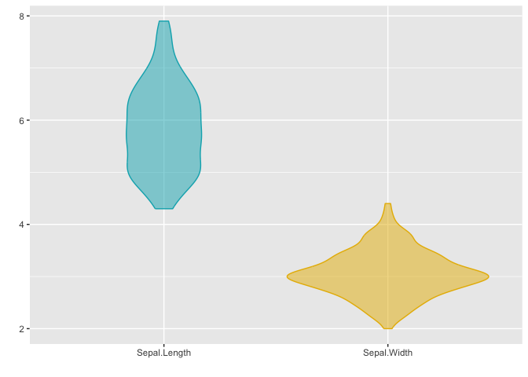
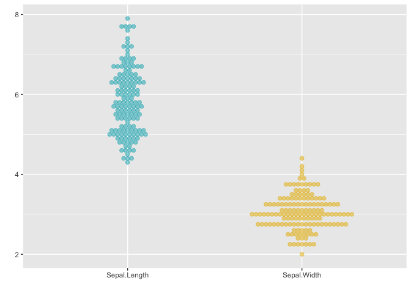
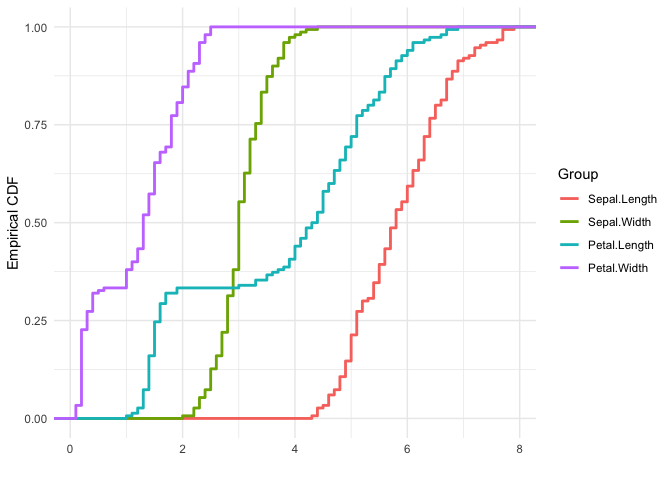
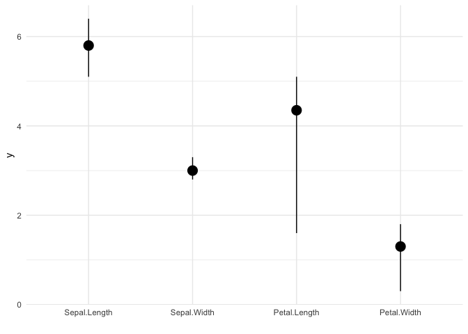

# ggmatplot

`ggmatplot` is a quick and easy way of plotting the columns of two
matrices or data frames against each other using
[`ggplot2`](https://ggplot2.tidyverse.org/).

## Overview

[`ggplot2`](https://ggplot2.tidyverse.org/) requires wide format data to
be wrangled into long format for plotting, which can be quite cumbersome
when creating simple plots. Therefore, the motivation for `ggmatplot` is
to provide a solution that allows
[`ggplot2`](https://ggplot2.tidyverse.org/) to handle wide format data.
Although `ggmatplot` doesn’t provide the same flexibility as
[`ggplot2`](https://ggplot2.tidyverse.org/), it can be used as a
workaround for having to wrangle wide format data into long format and
creating simple plots using [`ggplot2`](https://ggplot2.tidyverse.org/).

`ggmatplot` is built upon [`ggplot2`](https://ggplot2.tidyverse.org/),
and its functionality is inspired by
[`matplot`](https://www.rdocumentation.org/packages/graphics/versions/3.6.2/topics/matplot).
Therefore, `ggmatplot` can be considered as a `ggplot` version of
[`matplot`](https://www.rdocumentation.org/packages/graphics/versions/3.6.2/topics/matplot).

Similar to
[`matplot`](https://www.rdocumentation.org/packages/graphics/versions/3.6.2/topics/matplot),
`ggmatplot` plots a vector against the columns of a matrix, or the
columns of two matrices against each other, or a vector/matrix on its
own. However, unlike
[`matplot`](https://www.rdocumentation.org/packages/graphics/versions/3.6.2/topics/matplot),
`ggmatplot` returns a `ggplot` object. Therefore, [ggplot add
ons](https://ggplot2.tidyverse.org/reference/index.html) such as scales,
faceting specifications, coordinate systems and themes can also be added
on to the resultant `ggplot` object.

## Installation

The latest version can be installed from
[GitHub](https://github.com/xuan-liang/ggmatplot):

``` r
# install.packages("remotes")
remotes::install_github("xuan-liang/ggmatplot")
```

## Examples

``` r
library(ggmatplot)
```

The first example plots a vector against each column of matrix using the
default `plot_type = "point"` of `ggmatplot()`. We consider a simple
case that we have a covariate vector `x` and a matrix `z` with the
response `y` and the fitted value `fit.y` as the two columns.

``` r
# vector x
x <- c(rnorm(100, sd = 2))

# matrix z
y <- x * 0.5 + rnorm(100, sd = 1)
fit.y <- fitted(lm(y ~ x))
z <- cbind(
  actual = y,
  fitted = fit.y
)

ggmatplot(x, z)
```


If two matrices with equal number of columns are used, the corresponding
columns of the matrices will be plotted against each other. i.e. column
1 of matrix `x` will be plotted against column 1 of matrix `y`, column 2
of matrix `x` will be plotted against column 2 of matrix `y`, etc.

The next example uses the iris dataset, with matrices `x` and `y` as
shown below. The `Sepal.Length` is plotted against `Sepal.Width` and the
`Petal.Length` is plotted against `Petal.Width`. Therefore the groups
‘Column 1’ and ‘Column 2’ can be interpreted as ‘Sepal’ and ‘Petal’
respectively. To make the plot more meaningful, we can further add the
legend label and axis names by `legend_label`, `xlab` and `ylab`.

``` r
x <- (iris[, c(1, 3)])
head(x, 5)
#>   Sepal.Length Petal.Length
#> 1          5.1          1.4
#> 2          4.9          1.4
#> 3          4.7          1.3
#> 4          4.6          1.5
#> 5          5.0          1.4

y <- (iris[, c(2, 4)])
head(y, 5)
#>   Sepal.Width Petal.Width
#> 1         3.5         0.2
#> 2         3.0         0.2
#> 3         3.2         0.2
#> 4         3.1         0.2
#> 5         3.6         0.2

ggmatplot(x, y)
```


``` r
ggmatplot(x, y,
  xlab = "Length",
  ylab = "Width",
  legend_label = c("Sepal", "Petal")
)
```


The next example creates a line plot of vector `x` against the columns
of matrix `y` by using `plot_type = "line"`. Although the lines would be
represented using different colors by default, the `color` parameter
allows custom colors to be assigned to them.

The following plot assigns custom colors to the lines, and the limits of
the y axis are updated using the `ylim` parameter. Further, a ggplot
theme is added on to the resultant ggplot object.

``` r
# matrix x
x <- 1:10

# matrix y
y <- cbind(
  square = x^2,
  cube = x^3
)

ggmatplot(x, y,
  plot_type = "line",
  color = c("blue", "purple"),
  ylim = c(0, 750)
) +
  theme_minimal()
```


Next is plot of the US personal expenditure over 5 categories and 5
years, and is a simple example of how wide format data can be used with
`ggmatplot()`. Note how the expenditure categories to be used on the x
axis is used as vector `x`, and the expenditure values is used in wide
format as matrix `y` - with its columns corresponding to the grouping
structure.

The plot specifies the plot type as `plot_type = "both"`, which is a
combination of ‘point’ and ‘line’ plots. It customized using
`ggmatplot()` parameters and a `ggplot` theme as well.

``` r
USPersonalExpenditure
#>                       1940   1945  1950 1955  1960
#> Food and Tobacco    22.200 44.500 59.60 73.2 86.80
#> Household Operation 10.500 15.500 29.00 36.5 46.20
#> Medical and Health   3.530  5.760  9.71 14.0 21.10
#> Personal Care        1.040  1.980  2.45  3.4  5.40
#> Private Education    0.341  0.974  1.80  2.6  3.64

# vector x
x <- rownames(USPersonalExpenditure)

ggmatplot(x, USPersonalExpenditure,
  plot_type = "both",
  xlab = "Category",
  ylab = "Expenditure (in Billions of Dollars)",
  legend_title = "Year",
  legend_label = c(1940, 1945, 1950, 1955, 1960)
) +
  theme(axis.text.x = element_text(angle = 45, hjust = 1))
```


Density plots only accept a single matrix or data frame and will group
the plot based on its columns. The following density plot uses a two
column matrix, and groups the plot by the two columns. While the default
density estimate is represented in the measurement units of the data, an
aesthetic mapping is added on to the ggplot object to scale the density
estimate to a maximum of 1.

``` r
# matrix x
x <- (iris[, 1:2])

ggmatplot(x, plot_type = "density") +
  aes(y = stat(scaled)) +
  theme_bw()
```


Boxplots accept only a single matrix or data frame as well, and uses its
columns as individual groups. While `ggmatplot` plots are filled by
default, the fill color can be made transparent by using `alpha = 0`.

It is also worth noticing that `alpha` isn’t a parameter defined in
`ggmatplot()`, but can be used. This is because `ggmatplot` is built
upon `ggplot2`, and each `plot_type` corresponds to a
[`geom`](https://ggplot2.tidyverse.org/reference/index.html#section-geoms)
as listed
[here](https://xuan-liang.github.io/ggmatplot/reference/ggmatplot.html#plot-types).
Therefore, all valid parameters with the underlying
[`ggplot2 geom`](https://ggplot2.tidyverse.org/reference/index.html#section-geoms)
can be used with `ggmatplot()`.

``` r
# matrix x
x <- (iris[, 1:4])

ggmatplot(x,
  plot_type = "boxplot",
  alpha = 0, # removing fill values
  xlab = "", ylab = ""
)
```


Violin plots too accepts a single matrix or data frame input, and
behaves similar to density plots and boxplots.

This plot updates the colors of the two groups using the `color`
parameter, and it can be seen that the fill of the violin plots has been
updated too. This is because updating either the `color` or `fill`
parameter will automatically update the other, unless they are both
defined simultaneously.

``` r
# matrix x
x <- (iris[, 1:2])

ggmatplot(x,
  plot_type = "violin",
  color = c("#00AFBB", "#E7B800"),
  xlab = "", ylab = ""
)
```



Dotplots too accept a single matrix input and plots the distribution of
each of its columns.

The next example uses the `plot_type = "dotplot"` to visualize the
distribution of the data, and also customizes the position of the legend
using a `ggplot` theme as well.

``` r
# matrix x
x <- (iris[, 1:2])

ggmatplot(x,
  plot_type = "dotplot",
  color = c("#00AFBB", "#E7B800"),
  xlab = "", ylab = ""
) +
  theme(legend.position = "bottom")
```



Similar to density, violin, dotplots, and box plots, histograms too
accept a single matrix or data frame input and groups the plot using its
columns. The histogram in the following example uses a matrix of 4
columns, and therefore groups the plots based on these 4 columns. The
plot is also faceted by group.

The `color` and `fill` parameters have been defined simultaneously on
this plot. However, only a single `color` value is defined whereas the
number of `fill` colors correspond to the number of groups. If a single
value is defined it will be used over all groups, like the black line
color is used across all groups in this example.

``` r
# matrix x
x <- (iris[, 1:4])

ggmatplot(x,
  plot_type = "histogram",
  xlab = "Group",
  color = "black",
  fill = c("#F8766D", "#7CAE00", "#00BFC4", "#C77CFF")
) +
  facet_wrap(~Group, scales = "free")
```


The next example is of the `plot_type = ecdf`, and also uses a single
matrix input to plot out the empirical cumulative distributions of the
columns of the matrix individually.

``` r
# matrix x
x <- (iris[, 1:4])

ggmatplot(x,
  plot_type = "ecdf",
  xlab = "Group",
  size = 1
) +
  theme_minimal()
```



Error plots also accept only a single matrix input, and plots out error
bars for each column of the matrix. The `desc_stat` parameter of
`ggmatplot()` can be used to define what the mid point and error bars of
the plot should represent.

The next example, plots out an `errorplot` using the medians and
interquartile ranges of each variable.

``` r
# matrix x
x <- (iris[, 1:4])

ggmatplot(x,
  plot_type = "errorplot",
  desc_stat = "median_iqr",
  xlab = "Group",
  size = 1
) +
  theme_minimal()
```


